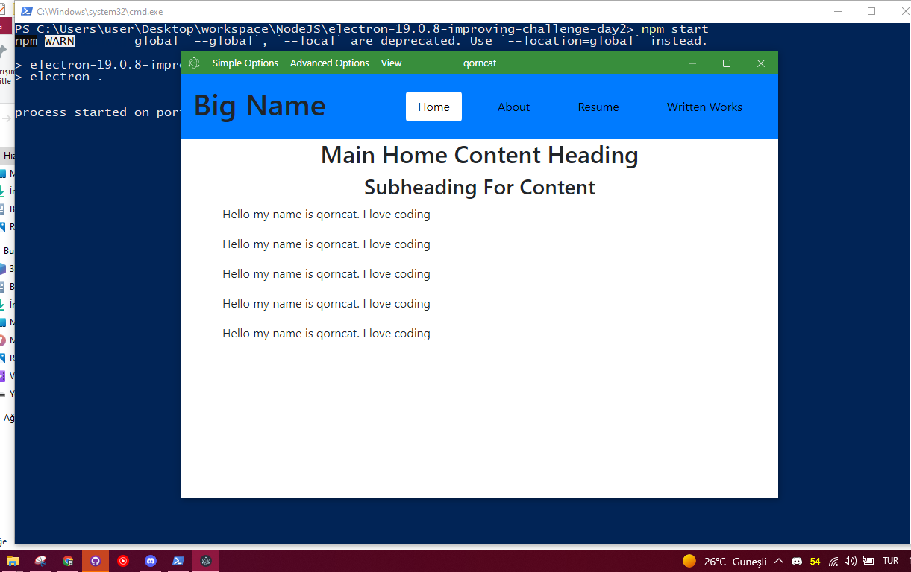

# electron-19.0.8-improving-challenge-day2
 Custom GUI for Electron with EJS
 
 NOTE: Don't change Express PORT because title bar module integrated with PORT
 NOTE: Don't delete ExpressJS/styles/icon.svg, and you can replace :)
 
 ```js
 npm install
 npm start
 ```
</img>